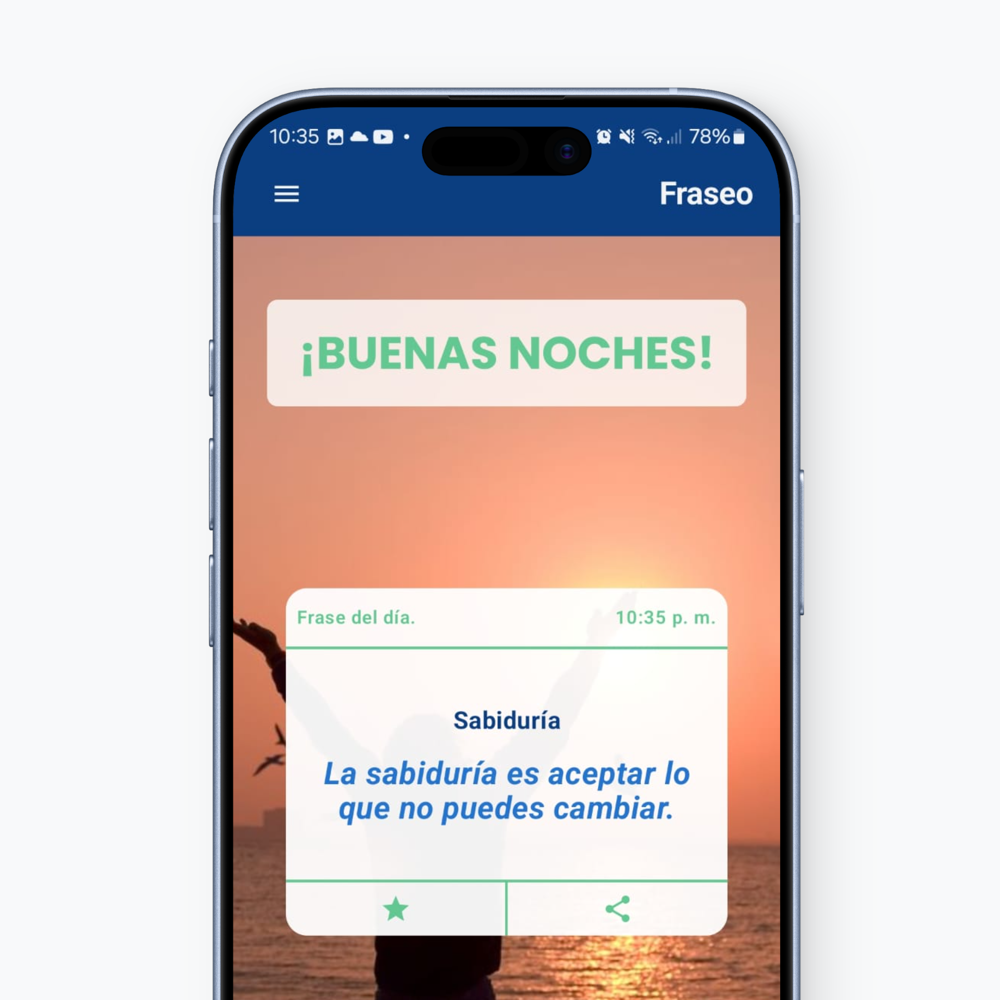
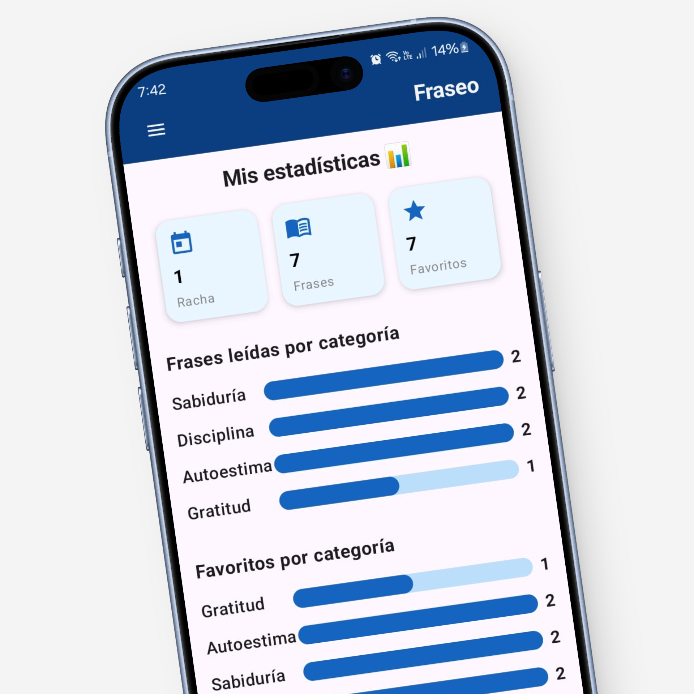

# FRASEO: LANDING PAGE

Landing page oficial de **Fraseo**, una aplicación móvil enfocada en bienestar, autoestima y motivación diaria mediante frases inspiradoras.

La página fue desarrollada para presentar el propósito y las funcionalidades principales de la aplicación, facilitar su descarga y ofrecer un medio de comunicación con los usuarios.

## Estado del proyecto

🟢 **Completado — Fase 1**

La primera fase de desarrollo de la landing page se encuentra implementada y publicada.

El proyecto continúa siendo susceptible de mejoras y ampliaciones en diseño, contenido y funcionalidades.

## 🌐 Demo

Puedes visitar la versión publicada del proyecto:

**[fraseo.site](https://fraseo.site/)**

Repositorio:

**[GitHub — LandingPageFraseoApp](https://github.com/DahbOne1/LandingPageFraseoApp)**

---

## 📖 Descripción

**Fraseo** es una aplicación móvil diseñada para acompañar al usuario en su día a día mediante frases motivacionales y contenido orientado al bienestar personal.

La landing page funciona como el punto de presentación del producto. Su objetivo es comunicar de forma clara qué es Fraseo, cuáles son sus principales características y cómo puede utilizarse, además de dirigir al usuario hacia la descarga de la aplicación.

La interfaz fue diseñada con un enfoque **responsive, limpio y orientado a la experiencia de usuario**, utilizando secciones visuales, llamadas a la acción, animaciones y contenido estructurado.

Actualmente la landing presenta:

* Presentación general de Fraseo.
* Llamadas a la acción para descargar la aplicación.
* Características principales.
* Beneficios de utilizar Fraseo.
* Testimonios de usuarios.
* Frase motivacional del momento.
* Preguntas frecuentes.
* Formulario de contacto.
* Aviso de privacidad.
* Términos de servicio.

---

## 🧩 Problema

Una aplicación móvil necesita comunicar rápidamente su propuesta de valor antes de que un usuario decida descargarla.

En el caso de Fraseo, era necesario contar con un sitio web que permitiera:

* Presentar la aplicación de manera atractiva.
* Explicar sus principales funcionalidades.
* Mostrar visualmente la experiencia de uso.
* Generar confianza en nuevos usuarios.
* Facilitar el acceso a la descarga.
* Ofrecer un canal de comunicación.

La landing page busca resolver este problema mediante una experiencia web sencilla y enfocada en la presentación del producto.

---

## 🎯 Objetivo

Desarrollar una landing page moderna, responsive y orientada a producto que permita:

* Presentar Fraseo y su propuesta de valor.
* Comunicar sus principales características.
* Mostrar elementos visuales de la aplicación.
* Facilitar la descarga desde Google Play.
* Permitir que los usuarios conozcan el funcionamiento de la aplicación.
* Proporcionar un canal de contacto.
* Mantener una estructura de código sencilla y fácil de mantener.

---

## ✨ Características

### 🏠 Landing page

La página principal presenta la propuesta de valor de Fraseo mediante una sección Hero con:

* Mensaje principal.
* Descripción del producto.
* CTA para descargar la aplicación.
* Mockup visual de la aplicación.
* Indicador de descargas.

### 📱 Presentación de características

La landing incluye una sección dedicada a explicar las principales funcionalidades de Fraseo, entre ellas:

* Frases motivacionales diarias.
* Compartir frases.
* Estadísticas y rachas.
* Seguimiento del progreso.
* Construcción de hábitos positivos.

### 💬 Testimonios

Se incorporó una sección de opiniones para representar la experiencia de usuarios de Fraseo y reforzar la confianza en el producto.

### 💭 Frase del momento

La landing incorpora una sección dinámica que muestra una frase seleccionada desde un archivo JSON local.

La lógica obtiene los datos mediante `fetch()`, selecciona una frase y actualiza dinámicamente el contenido de la interfaz.


### ❓ Preguntas frecuentes

Se incluye una sección FAQ para responder preguntas relacionadas con:

* Gratuidad de la aplicación.
* Compartir frases.
* Funcionamiento sin conexión.

### 📩 Formulario de contacto

La landing incorpora un formulario para que los usuarios puedan enviar preguntas o comentarios.

El envío se gestiona mediante **FormSubmit**, evitando la necesidad de implementar un backend propio para esta funcionalidad.

### ⚖️ Información legal

El proyecto incorpora modales para mostrar:

* Aviso de privacidad.
* Términos de servicio.

El contenido de estos apartados se gestiona mediante JavaScript y se inserta dinámicamente en un modal reutilizable.

### 🎞️ Animaciones

Se utiliza **AOS (Animate On Scroll)** para aplicar animaciones a diferentes secciones conforme aparecen dentro del viewport.

La configuración actual utiliza una duración de 1000 ms, ejecución única y un offset de 100 px.

### 📱 Diseño responsive

La interfaz utiliza clases responsive para adaptar la distribución del contenido a diferentes tamaños de pantalla.

El diseño contempla principalmente:

* Dispositivos móviles.
* Tablets.
* Escritorio.

---

## 📷 Capturas

### Vista principal


### Características



### Funcionalidades



### Aplicación


> Las imágenes utilizadas en esta sección forman parte de los recursos gráficos almacenados dentro del directorio `assets/img`.

---

## 🛠️ Tecnologías

### Frontend

* **HTML5** — estructura semántica de la aplicación web.
* **CSS3** — estilos personalizados.
* **JavaScript (ES6+)** — interacción y comportamiento dinámico.
* **Tailwind CSS** — sistema de utilidades CSS utilizado mediante CDN.
* **AOS (Animate On Scroll)** — animaciones al hacer scroll.

El proyecto carga Tailwind CSS y AOS directamente mediante CDN desde `index.html`.

### Datos

* **JSON** — almacenamiento local de frases utilizadas por la landing.
* `assets/data/bd.json` — fuente de datos utilizada para obtener la frase del momento.

La aplicación realiza la lectura del archivo JSON mediante `fetch()` y posteriormente selecciona una frase de manera aleatoria.

### Servicios externos

* **FormSubmit** — procesamiento del formulario de contacto.
* **Google Play** — distribución de la aplicación móvil.
* **AOS CDN** — carga de la biblioteca de animaciones.
* **Tailwind CSS CDN** — carga del framework CSS.

---

## 🏗️ Arquitectura

El proyecto utiliza una arquitectura **frontend estática**, sin servidor propio ni framework frontend.

La estructura puede representarse de la siguiente manera:

```text
Usuario
   │
   ▼
index.html
   │
   ├── Tailwind CSS
   ├── CSS personalizado
   ├── AOS
   │
   ├── JavaScript
   │     ├── Búsqueda
   │     ├── Frase del momento
   │     └── Modales
   │
   └── Datos JSON
         └── bd.json
```

La mayor parte de la interfaz se encuentra definida directamente en HTML, mientras que JavaScript se encarga de las funcionalidades dinámicas.

Esta arquitectura resulta adecuada para una landing page debido a su simplicidad, bajo costo de infraestructura y facilidad de despliegue.

---

## 📂 Estructura del proyecto

```text
LandingPageFraseoApp/
│
├── assets/
│   ├── data/
│   │   └── bd.json
│   │
│   └── img/
│       ├── Background.png
│       ├── Form.png
│       ├── Hero.png
│       ├── Mockup.jpeg
│       ├── background-phrases.webp
│       ├── features-number-three.png
│       ├── features-number-two.png
│       ├── features.png
│       ├── horizontal-logo-with-bg.png
│       ├── horizontal-logo.png
│       ├── icon.png
│       ├── instruccions.png
│       ├── user-one.webp
│       ├── user-two.webp
│       └── user-three.webp
│
├── css/
│   └── styles.css
│
├── js/
│   ├── get-phrases.js
│   ├── main.js
│   └── open-modal.js
│
├── pages/
│   ├── blog.html
│   └── thanks.html
│
├── index.html
└── README.md
```

La estructura actual del repositorio contiene los directorios `assets`, `css`, `js` y `pages`, además del archivo principal `index.html`.

### Principales directorios

#### `/assets`

Contiene los recursos estáticos utilizados por la landing.

* `/assets/data` → datos JSON.
* `/assets/img` → imágenes, logos, mockups y recursos gráficos.

#### `/css`

Contiene los estilos CSS personalizados del proyecto.

```text
css/
└── styles.css
```

#### `/js`

Contiene la lógica JavaScript de la aplicación:

```text
js/
├── get-phrases.js
├── main.js
└── open-modal.js
```

* `get-phrases.js` → obtiene y muestra una frase desde `bd.json`.
* `main.js` → gestiona funcionalidades relacionadas con búsqueda y formulario.
* `open-modal.js` → controla los modales de información legal.

#### `/pages`

Contiene páginas HTML adicionales.

```text
pages/
├── blog.html
└── thanks.html
```

---

## 🚀 Instalación

Al tratarse de una aplicación frontend estática, no es necesario instalar Node.js, npm ni dependencias del proyecto para ejecutar la versión actual.

### Requisitos previos

Se recomienda contar con:

* Git.
* Un navegador web moderno.
* Un editor de código como Visual Studio Code.
* Un servidor local para ejecutar correctamente los recursos cargados mediante `fetch()`.

> Aunque el proyecto es estático, utilizar un servidor local es recomendable para evitar problemas relacionados con las políticas de seguridad del navegador al cargar archivos JSON mediante `fetch()`.

### 1. Clonar el repositorio

```bash
git clone https://github.com/DahbOne1/LandingPageFraseoApp.git
```

### 2. Entrar al proyecto

```bash
cd LandingPageFraseoApp
```

### 3. Instalar dependencias

No existen dependencias npm que instalar en la versión actual del proyecto.

Tailwind CSS y AOS se cargan mediante CDN desde `index.html`.

### 4. Configurar variables de entorno

No se requieren variables de entorno para ejecutar la versión actual.

El proyecto utiliza recursos externos y servicios configurados directamente en el HTML, incluyendo FormSubmit y Google Play.

### 5. Ejecutar el proyecto

Puedes utilizar cualquier servidor HTTP local.

Por ejemplo, utilizando **Live Server** desde Visual Studio Code:

1. Abrir el proyecto en Visual Studio Code.
2. Instalar la extensión **Live Server**.
3. Abrir `index.html`.
4. Seleccionar **Open with Live Server**.

También puede utilizarse cualquier servidor HTTP local equivalente.

---

## 💻 Uso

### Flujo principal

El flujo principal de la landing está diseñado de la siguiente manera:

```text
Usuario
   │
   ▼
Landing Page
   │
   ├── Conocer Fraseo
   │
   ├── Explorar características
   │
   ├── Consultar frase del momento
   │
   ├── Leer preguntas frecuentes
   │
   ├── Contactar
   │
   └── Descargar aplicación
            │
            ▼
       Google Play
```

El CTA principal dirige al usuario hacia la aplicación de Fraseo disponible en Google Play.

---

## 🚧 Retos del proyecto

### ¿Cómo fueron solucionados?

### 1. Mantener una interfaz atractiva sin utilizar un framework frontend

Uno de los retos fue construir una interfaz moderna utilizando HTML, CSS y JavaScript sin depender de frameworks como React, Vue o Angular.

Para resolverlo se utilizó Tailwind CSS como sistema de utilidades, permitiendo construir rápidamente layouts responsive y componentes visuales directamente desde HTML.

### 2. Incorporar contenido dinámico en una landing estática

La página necesitaba mostrar información dinámica, como la frase del momento.

Para esto se utilizó un archivo JSON local como fuente de datos y JavaScript mediante `fetch()` para obtener la información y actualizar el DOM.

### 3. Crear modales reutilizables

Los términos de servicio y el aviso de privacidad necesitaban mostrarse sin obligar al usuario a abandonar la página.

Se implementó un sistema de modales controlado mediante JavaScript, utilizando una estructura de datos para definir el contenido de cada modal.

### 4. Incorporar animaciones sin aumentar considerablemente la complejidad

Para mejorar la experiencia visual se incorporó AOS, permitiendo agregar animaciones mediante atributos HTML como `data-aos`.

### 5. Mantener una solución sencilla de desplegar

Al no utilizar un backend ni un proceso de build, el proyecto puede desplegarse como un sitio estático.

Esto simplifica considerablemente su mantenimiento y reduce los requisitos de infraestructura.

---

## 🧠 Decisiones técnicas

### HTML, CSS y JavaScript

Se decidió utilizar tecnologías web fundamentales para mantener el proyecto ligero y fácil de comprender.

Esta decisión también permitió trabajar directamente con:

* DOM.
* Eventos.
* Fetch API.
* JSON.
* Formularios.
* Componentes visuales basados en HTML.

### Tailwind CSS mediante CDN

Tailwind CSS fue utilizado para acelerar el desarrollo de la interfaz y mantener consistencia en:

* Espaciado.
* Tipografía.
* Responsive design.
* Colores.
* Layout.
* Estados hover.

El proyecto actualmente utiliza Tailwind mediante CDN, por lo que no existe una configuración de build específica para Tailwind.

### JSON como fuente de datos

Para la funcionalidad de frases se optó por almacenar los datos en JSON.

Esto permite mantener separada la información del contenido respecto a la lógica encargada de procesarlo.

### JavaScript modularizado por responsabilidad

La lógica JavaScript se distribuyó en diferentes archivos:

* `main.js`
* `get-phrases.js`
* `open-modal.js`

Esta separación permite evitar concentrar toda la lógica en un único archivo.

### Servicios externos

Para funcionalidades que no justificaban la creación de un backend propio se utilizaron servicios externos.

El formulario de contacto utiliza FormSubmit para procesar los envíos.

---

## 📚 Aprendizajes

El desarrollo de FRASEO permitió reforzar conocimientos relacionados con:

* Maquetación avanzada con HTML5.
* Responsive Web Design.
* CSS y Tailwind CSS.
* JavaScript para manipulación del DOM.
* Eventos del navegador.
* Fetch API.
* Consumo de archivos JSON.
* Renderizado dinámico de contenido.
* Gestión de modales.
* Validación de formularios.
* Animaciones en interfaces web.
* Organización de proyectos frontend.
* Optimización de experiencia de usuario.
* Integración con servicios externos.
* Despliegue de sitios web estáticos.

Además, el proyecto permitió trabajar en la evolución de una interfaz real orientada a un producto, pasando de una simple página informativa a una landing enfocada en **presentación, conversión y experiencia de usuario**.

---

## 🔮 Próximas mejoras

Algunas mejoras consideradas para futuras fases son:

* [ ] Mejorar la arquitectura del JavaScript.
* [ ] Separar completamente las funcionalidades de búsqueda y contacto.
* [ ] Implementar un sistema de build para Tailwind CSS.
* [ ] Optimizar y comprimir recursos gráficos.
* [ ] Mejorar accesibilidad.
* [ ] Mejorar SEO técnico.
* [ ] Incorporar Open Graph y Twitter/X Cards.
* [ ] Incorporar una estrategia de metadatos más completa.
* [ ] Ampliar la sección de blog.
* [ ] Mejorar la funcionalidad de búsqueda.
* [ ] Añadir más contenido dinámico.
* [ ] Incorporar métricas de analítica.
* [ ] Mejorar el sistema de contacto.
* [ ] Añadir soporte para más plataformas de descarga.
* [ ] Evaluar la migración futura hacia una arquitectura más escalable si el proyecto continúa creciendo.

---

## 🤝 Contribuciones

Actualmente este repositorio funciona principalmente como proyecto personal y de portafolio.

Las sugerencias, reportes de errores y propuestas de mejora son bienvenidas mediante:

* Issues.
* Pull Requests.
* Contacto directo con el autor.

Antes de realizar cambios importantes se recomienda abrir un Issue para discutir la propuesta.

---

## 👨‍💻 Autor

**David Hernández**

Ingeniero en Sistemas Computacionales y desarrollador web enfocado en la construcción de aplicaciones y experiencias digitales.

### Enlaces

* 🌐 **Web:** [fraseo.site](https://fraseo.site/)
* 💻 **Repositorio:** [GitHub](https://github.com/DahbOne1/LandingPageFraseoApp)

---

## 📄 Licencia

Este proyecto y su código fuente pertenecen a su autor.

El contenido, diseño, identidad visual, marca y recursos asociados con **Fraseo** están destinados al proyecto y no deben reutilizarse, redistribuirse o comercializarse sin autorización previa.

© 2026 Fraseo. Todos los derechos reservados.
